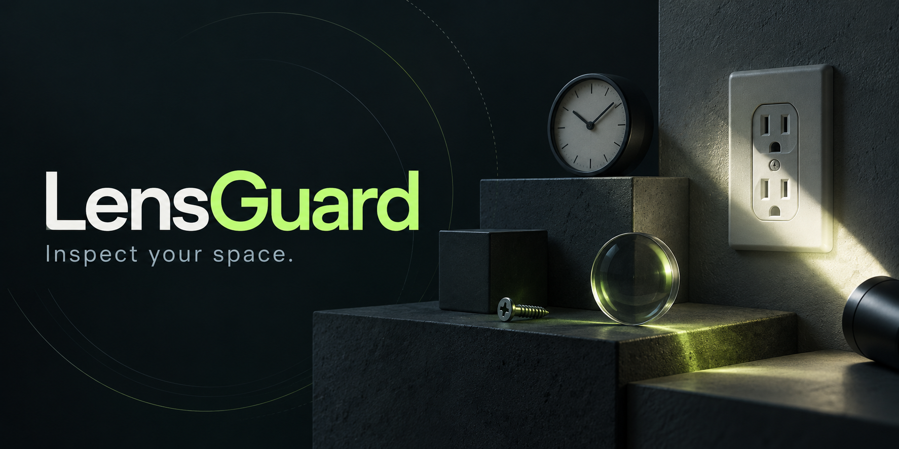
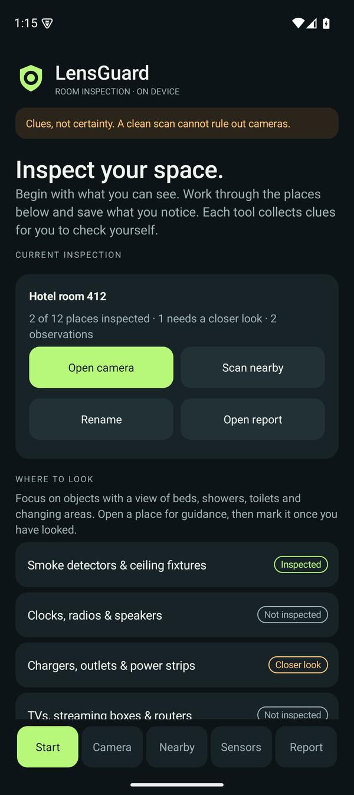
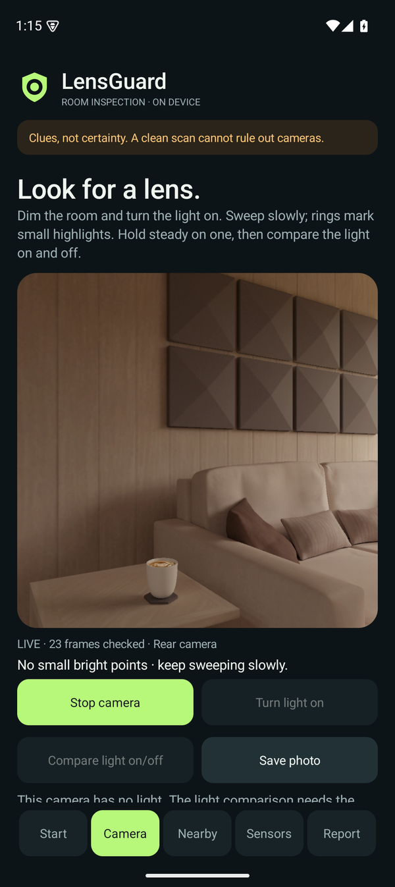
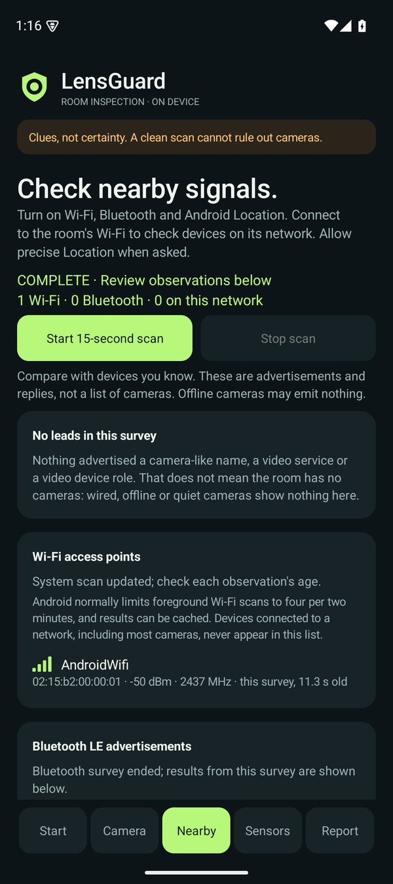
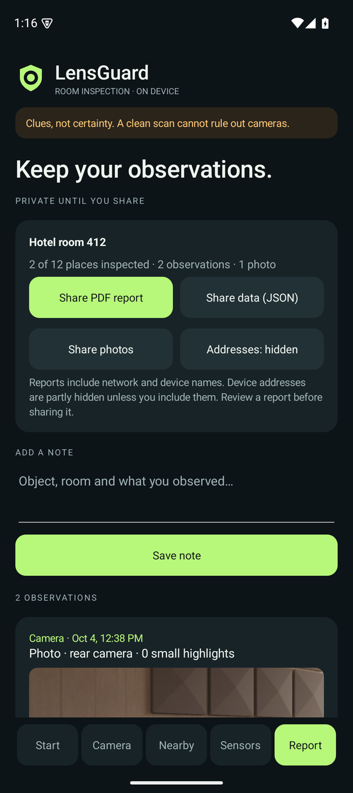

# LensGuard

[](https://github.com/Feloguarin/LensGuard/actions/workflows/android.yml)
[](LICENSE)
[](#install-on-your-phone)

**An open-source Android companion for inspecting your space.** A checklist guides you through common hiding places. The camera marks small highlights and compares them with the light on and off. A nearby scan lists wireless and network leads, and everything you save becomes a shareable report. Designed for Google Pixel 9; adapts to the sensors Android exposes on other phones. Available in English and Spanish.

**[Download the APK](https://github.com/Feloguarin/LensGuard/releases/latest/download/LensGuard.apk)** · [Try it in 10 minutes](docs/TESTING.md) · [Contribute](CONTRIBUTING.md) · [Brand kit](docs/BRAND.md)

> [!IMPORTANT]
> **Had LensGuard 1.0 or 1.1?** Android will say it can't update the app. Uninstall the old version once, then install 2.0 ([steps](#install-on-your-phone)). From 2.0 on, updates install normally and keep your inspections.

> LensGuard provides inspection clues. It cannot confirm a hidden camera or prove that a room is camera-free. This is an evaluation build; physical Pixel 9 validation is still pending.

*The banner is a conceptual brand illustration, not an app screenshot or a confirmed-camera example.*

## Install on your phone

1. **If you had LensGuard 1.0 or 1.1, uninstall it first:** **Settings → Apps → See all apps → LensGuard → Uninstall**. Those versions were signed with temporary keys, so Android cannot update them. Uninstalling deletes their notes and photos, so share anything you want to keep before you do.
2. On your phone, download **LensGuard.apk** from [GitHub Releases](https://github.com/Feloguarin/LensGuard/releases/latest). An APK is an Android installer; you don't need Android Studio or an account.
3. Open the download. If Android asks, allow installs from the browser or Files app you used, then follow the prompts. Keep Play Protect on and read any warning before you continue ([Google's guidance](https://support.google.com/pixelphone/answer/2812853?hl=en)).
4. Open **LensGuard** and grant permissions when you choose a tool. For a complete nearby scan, turn on Wi-Fi, Bluetooth and Location, and join the room's Wi-Fi to check devices on its network.
5. Practise on a known camera and ordinary household objects with the [quick test](docs/TESTING.md).

**Requirements:** Android 9+ (API 28). Current app: 2.0.0; targets API 35. No Play Store listing yet.

**Updates:** from 2.0.0 on, every release is signed with LensGuard's permanent key, so a newer APK installs over the old one and keeps your inspections. Each release's notes say which key signed it, and its `signing-certificate.txt` lists the certificate.

### If it won't install

| What the phone says | What to do |
| --- | --- |
| "App not installed as package conflicts with an existing package", "can't update" or "App not installed" | An older LensGuard is still on the phone: 1.0 or 1.1, a build you made yourself, or a copy in another profile. Uninstall it (Settings → Apps → See all apps → LensGuard → Uninstall, or ⋮ → **Uninstall for all users** where offered), then open the APK again. |
| "Not allowed to install unknown apps from this source" | Tap **Settings** on the message and allow installs for that browser or Files app. |
| "Blocked by Play Protect" or "Unsafe app blocked" | Play Protect warns about apps that aren't on the Play Store. Read the warning; if you downloaded the APK from this repository's Releases page, tap **More details → Install anyway**. |
| "There was a problem parsing the package" | The download is incomplete, or the phone runs Android 8 or older. Download it again; LensGuard needs Android 9 or newer. |

Still stuck? [Open an issue](https://github.com/Feloguarin/LensGuard/issues/new/choose) with the exact message and your phone model.

## What you can do

| Tab | Tools | How to interpret them |
| --- | --- | --- |
| **Start** | The current inspection and a checklist of 12 common hiding places with guidance; mark each *Inspected* or *Needs a closer look* and add notes | The checklist guides your search. It detects nothing by itself. |
| **Camera** | Lens finder: rings mark small highlights on the preview, *steady* rings stay put while you hold still, and **Compare light on/off** separates reflections of the phone light from light sources. Also tap-to-focus, flashlight, zoom/exposure and private photos | A lens can reflect the phone light, and so can glass, metal and glossy plastic. Rings mark places to inspect, never a camera. |
| **Nearby** | 15-second scan of Wi-Fi access points, Bluetooth LE advertisements and the connected Wi-Fi network (ONVIF/UPnP discovery, RTSP/HTTP/ONVIF services), with **Leads to inspect** and **Follow signal** for one Bluetooth device | A lead is a name or service cameras commonly use, not proof. Wired, offline or quiet cameras show nothing. |
| **Sensors** | Magnetic comparison with a chart and peak change, sensor diagnostics, experimental sound check | Most useful on objects that should contain no electronics. Metal and magnets change readings too. |
| **Report** | Observation log with photos and notes, several inspections, PDF/JSON report and photo sharing, evidence deletion | Device addresses are partly hidden unless you include them. Evidence stays on the phone until you share it. |

No accounts, ads, analytics or cloud detection. Camera frames and microphone samples are analyzed locally; audio is not recorded to storage. A nearby scan sends standard discovery requests on your Wi-Fi network but never connects to devices. [Privacy details](PRIVACY.md)

## App preview

<p></p>

Actual Android 15 emulator screenshots of version 2.0.0. The camera image is the emulator's virtual scene; it is not a hidden-camera detection result.

## Your first 10-minute test

1. **Camera → Start camera → Turn light on:** point the rear camera at a visible webcam or another phone's camera from 20–50 cm. Watch for a ring on the lens, hold still until it turns *steady*, then tap **Compare light on/off** and keep still for about four seconds. Repeat with a shiny screw, glass and an LED: they can produce rings too.
2. **Start → choose a place → Needs a closer look**, and add a short note. Open **Inspect with camera** from that place and **Save photo**; the banner shows which place it is linked to.
3. **Sensors → Open magnetic check → Set baseline:** hold still, away from metal, for about three seconds. Move near a speaker or steel object and watch the chart and largest change. A change is not a camera verdict.
4. **Nearby → Start 15-second scan:** check that your known Wi-Fi access point appears, review the leads and the *This Wi-Fi network* section, and try **Follow signal** on a Bluetooth device you own.
5. **Report → Share PDF report:** check that the report contains what you intended and that device addresses are partly hidden. Background the app and check that camera, microphone and scanning stop.

Record passes, failures and misses instead of assuming detection worked. Follow the [full beginner guide](docs/TESTING.md), [physical-device checklist](docs/DEVICE_TEST_PLAN.md) and [test-results template](docs/test-results/TEMPLATE.md).

## What has actually been verified

| Check | Current evidence |
| --- | --- |
| Build and lint | Passed; lint has no errors. The only warnings are notices about newer dependency versions. |
| Automated tests | 78 tests pass in each of the debug and release variants. They cover highlight detection, overlay geometry, steady tracking, the light comparison sequence, discovery parsing, leads, storage, migration and reports, plus activity flows in English and Spanish on API 28 and 35. |
| APK signature and download | Verified by CI before publishing; each GitHub release includes the APK, SHA-256 checksum and signing-certificate information. From 2.0.0, releases are signed with the permanent release key (certificate SHA-256 `FF:BD:95:84:8D:D9:A6:E6:15:97:0A:26:22:E6:7A:BD:A0:D6:8F:89:8B:EF:55:E9:CE:55:15:D2:A5:6A:A6:3D`). |
| Android 15 emulator | Checklist, camera frames and overlay alignment, nearby scan, magnetic chart, photo capture, PDF export and Spanish UI checked. See the [2.0 test record](docs/test-results/2026-10-04-emulator-2.0.md). The emulator has no flashlight, so the light comparison ran only in automated tests. |
| Network discovery on a real network | The app's ONVIF/UPnP requests and reply parser were checked from a Mac on a home network: the router's 20 UPnP replies were read correctly as one device, and no ONVIF device answered. Sending and listening from a phone is still untested. |
| Physical Pixel 9 behavior | **Pending community/device testing.** |
| Hidden-camera detection accuracy | **Not established.** No certified sensitivity, false-positive rate or room-clear claim. |

See [hardware and detection limits](docs/HARDWARE_AND_LIMITS.md) for official Google/Android sources and [CHANGELOG.md](CHANGELOG.md) for project history.

## Build from source

Install Git, JDK 17 and the Android SDK with platform 35 and build-tools 35.0.0. Android Studio can manage the SDK. Set `ANDROID_HOME`/`ANDROID_SDK_ROOT`, or put `sdk.dir=/absolute/path/to/your/sdk` in ignored `local.properties`.

```sh
git clone https://github.com/Feloguarin/LensGuard.git
cd LensGuard
./scripts/prepare-development-key.sh
./gradlew lint test assembleRelease
```

Output: `app/build/outputs/apk/release/app-release.apk`. Windows users can run `gradlew.bat`; see [CONTRIBUTING.md](CONTRIBUTING.md) for setup, development signing, installing debug builds and project structure.

The Gradle wrapper pins Gradle 8.11.1; Android Gradle Plugin is 8.9.2. GitHub Actions validates the app and publishes evaluation APKs for pushes to `main`. Pull requests run checks without publishing.

## Open source and contributions

The source and included brand assets are **MIT-licensed**: you may inspect, modify and redistribute them under the [license terms](LICENSE). The repository is public. You do not need permission to fork it or open a pull request.

Useful first contributions include real-device test reports (especially of the light comparison), permission/lifecycle fixes, accessibility improvements, more translations and better measured heuristics. Please avoid unsupported detection claims and keep private photos/network identifiers out of public reports.

- [Contributing guide](CONTRIBUTING.md)
- [Report a bug or device test](https://github.com/Feloguarin/LensGuard/issues/new/choose)
- [Security reporting](SECURITY.md)
- [Brand assets and usage](docs/BRAND.md)

Built by [Felipe Guarin](https://github.com/Feloguarin). Independent project; not affiliated with Google. Pixel is Google's product name.
